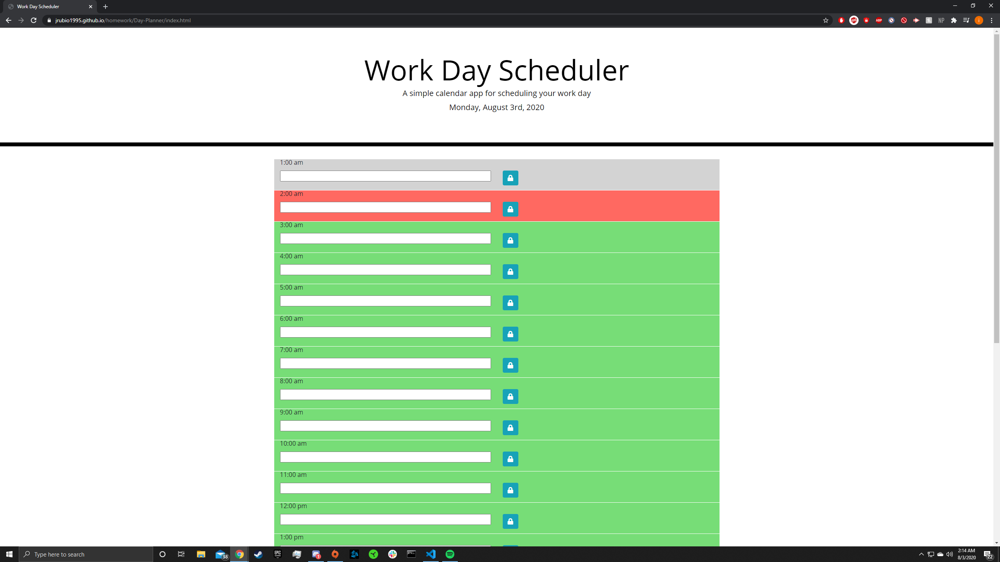

In this activity we learned how to use jquery in Javascript. For a example from line 39 to line 58. Is solely to add all the time rows and buttons. Line 61 to 66 is for the color coronated section. So if the current time is 2 o'clock it should be red and gray if it has already passed that time and lastly green if the time has not passed. Current day should be displayed on the jumbotron class in the html.
