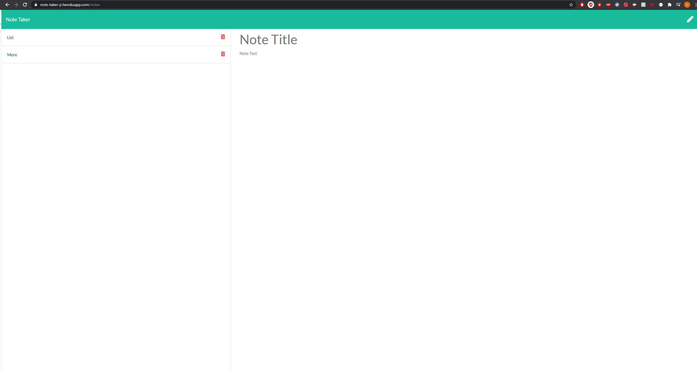

# Note-Taker

## Description

To write down notes

## Table of Contents

[Installation](#installation)

[Usage](#usage)

[Contributing](#contributing)

[Tests](#tests)

[Questions](#questions)

[License](#license)

## Installation

eiteher you can download the repository (and run "npm install") or you can just click on the link where it is deployed in Heroku.

## Usage

## Contributing

## Tests

undefined

## Questions

Github username : Jrubio1995

Link to my profile: https://github.com/Jrubio1995

If you have any additional questions, you can reach me at Jesusrubio16@yahoo.com.

## License

Licensed under the Unlicense license.
